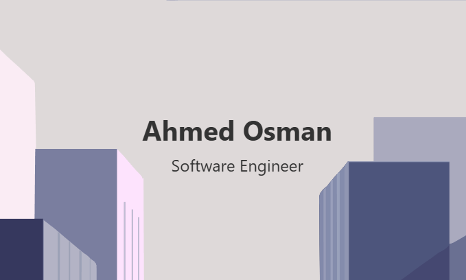
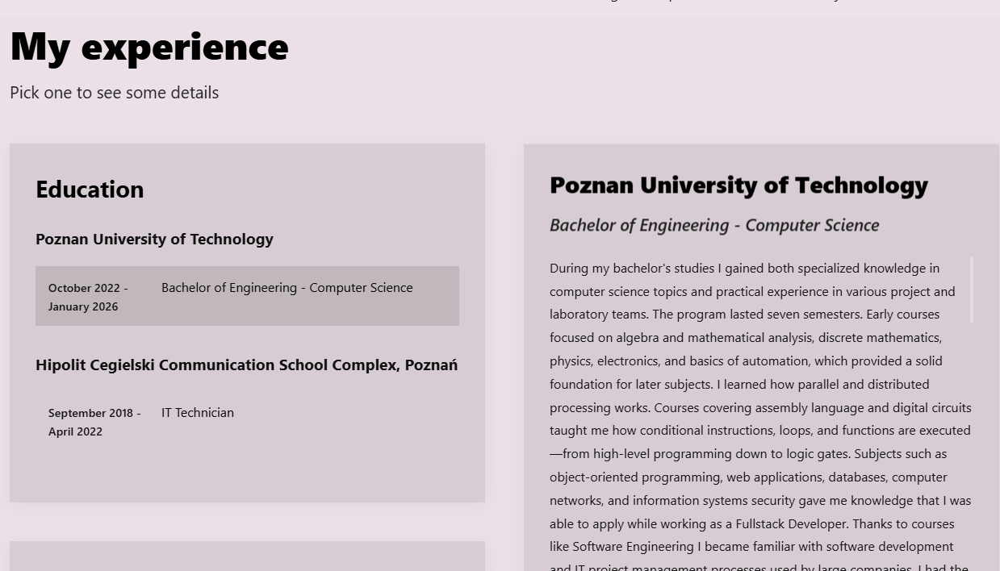
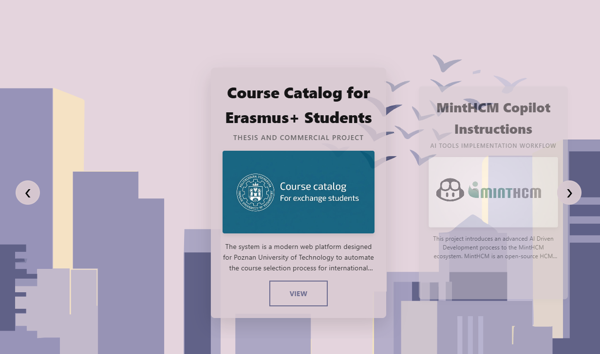
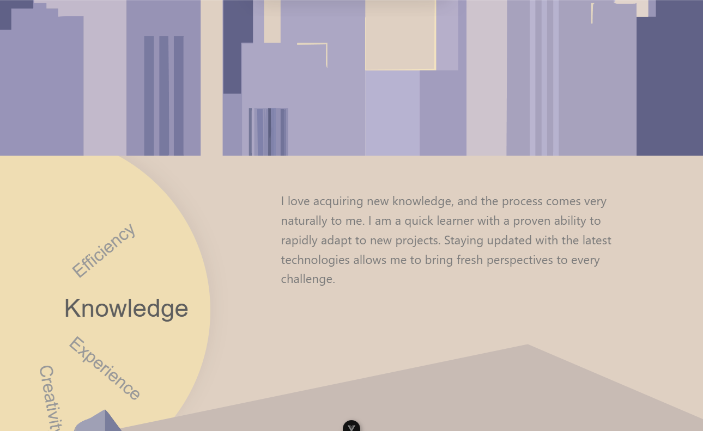

# Ahmed Osman - Personal Portfolio




## 🌆 About the Project

My website is an original concept supported by AI-generated graphics. The composition depicts a city's daily cycle — from dawn to sunset. It is an interactive one-page portfolio showcasing my skills, experience, and completed projects.

## 🚀 Key Features

### 🎨 Dynamic Sky System

The page background smoothly transitions colors while scrolling, simulating the passage of a day. This is achieved via a fixed container that reacts to the user's scroll progress.

### 🏢 Interactive Experience (Floating Details)

The experience section features an innovative floating details block that smoothly follows the user while scrolling, using advanced JavaScript position calculations.


_Experience details following the user with a motion easing algorithm._

### 🎡 Projects Carousel

An interactive showcase of completed projects with drag gesture support and automatic card snapping to the center of the screen.


_Custom carousel system combined with Vuetify photo galleries._

### 🎨 Design & Responsiveness

The site is fully optimized for mobile devices, featuring a dynamic sky background and unique mobile menu animations.


_Consistent design adapted to every screen size._

### 🌍 Multilingual & Accessible

The site supports Polish and English versions. Everything is optimized for accessibility (ARIA labels, semantic HTML) and full responsiveness (RWD), ensuring a consistent experience on every device.

## 🛠️ Tech Stack

- **Framework:** Vue 3 (Composition API)
- **Build Tool:** Vite
- **State Management:** Pinia (data & language handling)
- **UI Library:** Vuetify 3
- **Animations:** Custom JS + CSS Transitions
- **Graphics:** AI Generated SVG & Images

## 📦 Installation & Setup

1. Clone the repository:

   ```bash
   git clone https://github.com/ahmosman/ahmedosman-portfolio.git
   ```

2. Install dependencies:

   ```bash
   npm install
   ```

3. Run the development server:

   ```bash
   npm run dev
   ```

4. Build for production:
   ```bash
   npm run build
   ```
